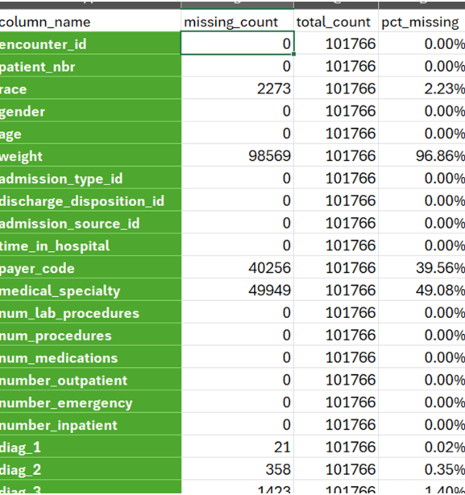
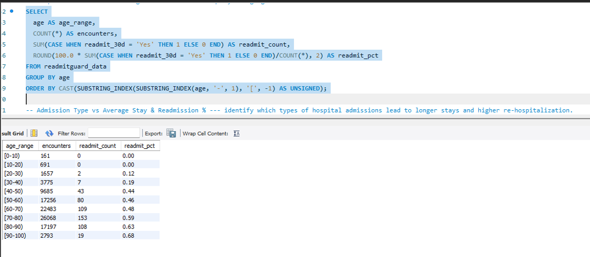
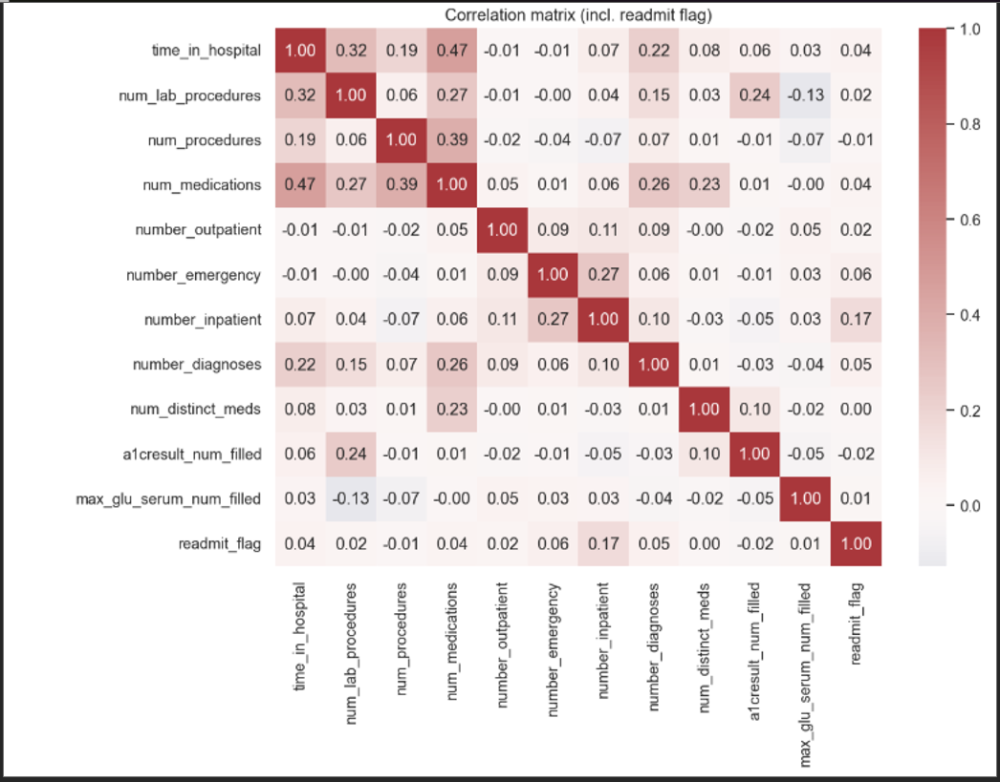
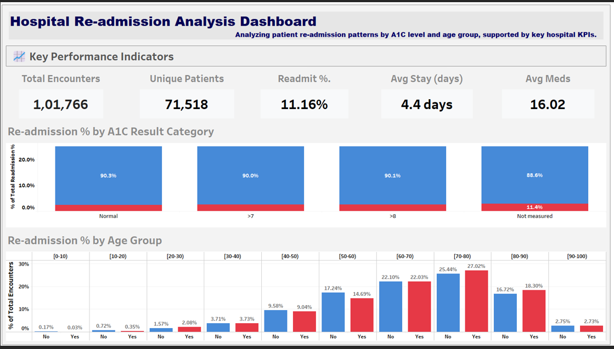
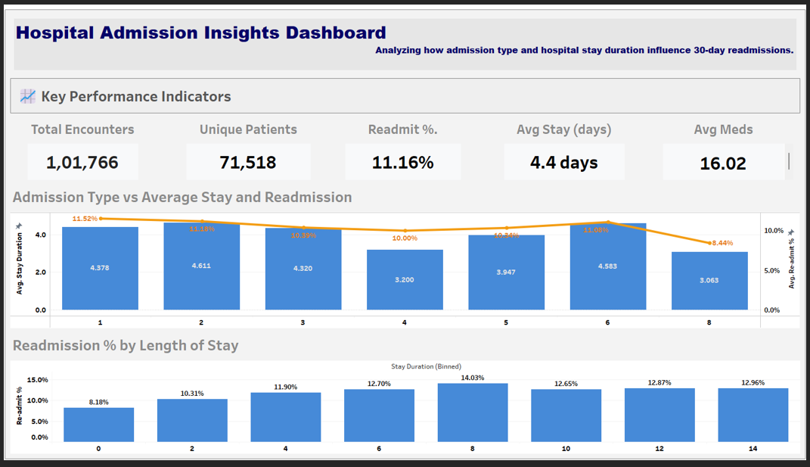
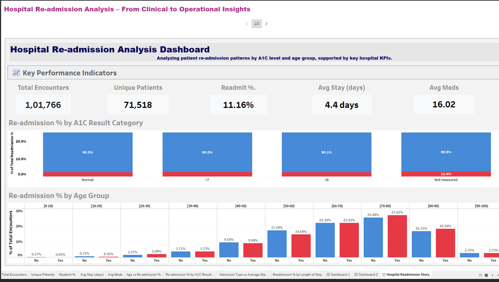
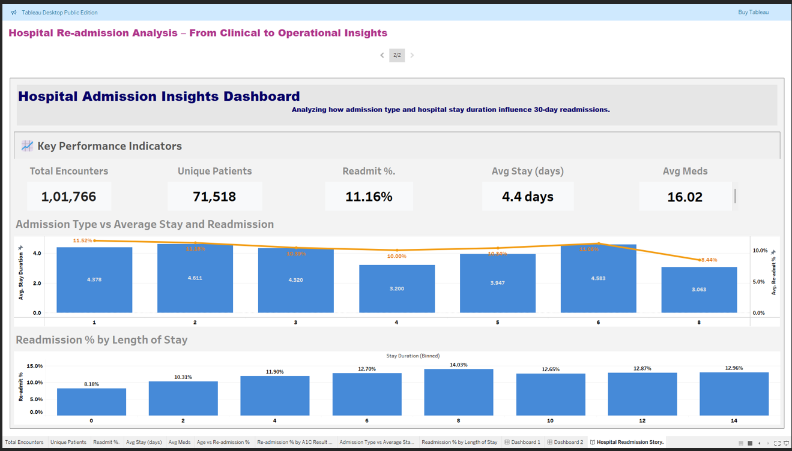

# 🏥 Healthcare Readmission Analytics

> **Predicting 30-day hospital readmissions using SQL, Python, and Tableau**

---

## 📋 Overview
This end-to-end analytics project explores **factors contributing to 30-day patient readmissions** in hospitals using a structured, reproducible workflow.  
It demonstrates the use of **Excel**, **MySQL**, **Python (pandas, matplotlib)**, and **Tableau** to clean, analyze, and visualize clinical data — turning raw hospital records into actionable insights.

**Goal:** Identify key predictors of patient readmission and design a streamlined dashboard for healthcare administrators.

---

## 🧭 Project Workflow

### 🪜 Step 1 — Excel (Initial Cleaning & Summary)
- Imported and validated raw dataset.
- Replaced placeholders (`?`, `Unknown`, `None`) with blanks or NULL.
- Dropped columns with >30% missing data (`weight`, `payer_code`, `medical_specialty`).
- Created pivot tables for basic demographic summaries.

  

<i>Figure — Missing values summary and dropped columns during Excel cleaning.</i>

**Key findings:**
- Missing values mainly in lab fields and non-critical demographics.
- Dataset reduced from 50 to 47 columns with minimal data loss.

---

### ⚙️ Step 2 — SQL (Data Cleaning & ETL)
- Loaded cleaned CSV into MySQL using `LOAD DATA LOCAL INFILE`.
- Created `healthcare_readmission` table.
- Replaced placeholders via `NULLIF()` and added indexes on critical columns.
- Aggregated patient encounters by age, gender, admission type, and diagnosis.

  

<i>Figure — SQL query results showing readmission rate by admission type.</i>

**Key findings:**
- Average readmission rate: **≈12%** across all encounters.  
- Emergency admissions and chronic diabetic patients show higher readmission frequency.

---

### 🧠 Step 3 — Python (EDA & Feature Engineering)
- Conducted exploratory data analysis in `healthcare_eda_feature_engineering.ipynb`.
- Encoded lab results (`A1Cresult`, `max_glu_serum`) into categorical bins.
- Engineered new features: `num_distinct_meds`, `medication_change_flag`.
- Exported Tableau-ready dataset: `healthcare_processed.csv`.

  

<i>Figure — Correlation heatmap showing relationships between key numeric variables.</i>

**Key findings:**
- “Not Measured” lab values strongly correlate with higher readmission risk.
- Medication count and duration of stay are significant contributors to readmission.

---

### 📈 Step 4 — Tableau (Visualization & Storytelling)
- Created two main dashboards and a Tableau Story in `healthcare_dashboard.twbx`.
- Visualized KPIs: total patients, average stay, 30-day readmission %, and age/race distributions.
- Developed filters for A1C levels, admission type, and length of stay.

  

  

<i>Figures — Executive dashboards showing readmission KPIs and demographic filters.</i>

**Key insights:**
- Older patients (60+) and those with poor A1C control have the highest readmission rates.
- Emergency admissions lead to significantly higher readmission risk than elective cases.

---

### 🎬 Step 5 — Tableau Story (Final Presentation)
- Combined the clinical and operational dashboards into a 2-slide Tableau Story.
- Presented readmission trends alongside controllable variables like admission source and length of stay.

  

  

<i>Figures — Two-part Tableau Story integrating clinical and operational insights.</i>

---

## 🧰 Tools & Technologies

| Layer | Tools / Libraries |
|-------|-------------------|
| Data Cleaning | **Excel** |
| Data Querying | **MySQL (SQL)** |
| EDA & Feature Engineering | **Python** — pandas, matplotlib, numpy |
| Visualization | **Tableau (Workbook: healthcare_dashboard.twbx)** |
| Documentation | **Markdown, GitHub** |

---

## 🧾 Dataset Information

- **File:** `data/raw/healthcare_raw.csv`  
- **Rows:** 101,766  
- **Columns:** 47  
- **Target variable:** `readmit_30d` (Binary: “Yes” / “No”)  
- **Processed export:** `data/processed/healthcare_processed.csv`

📘 Full dataset description: [`README_dataset_info.txt`](data/raw/README_dataset_info.txt)  
🔒 Data access policy: [`DATA_ACCESS_NOTE.txt`](data/raw/DATA_ACCESS_NOTE.txt)

---

## 📄 Project Report
You can read the complete report and executive summary here:  
👉 [**healthcare_readmission_report.pdf**](docs/report/healthcare_readmission_report.pdf)

---
## 📁 Repository Structure

healthcare-readmission-analytics/
├── README.md
├── data/
│ ├── raw/
│ │ ├── healthcare_raw.csv
│ │ ├── README_dataset_info.txt
│ │ └── DATA_ACCESS_NOTE.txt
│ └── processed/
│ ├── healthcare_processed.csv
│ └── README_placeholder.txt
├── sql/
│ └── sql_healthcare_readmission.sql
├── python/
│ └── healthcare_eda_feature_engineering.ipynb
├── tableau/
│ └── healthcare_dashboard.twbx
├── src/
│ ├── README_placeholder.txt
│ └── prompts_used.txt
└── docs/
├── report/
│ └── healthcare_readmission_report.pdf
└── images/
├── columns_dropped.png
├── sql-sample-query.png
├── correlation_py.png
├── tableau_dashboard-1.png
├── tableau_dashboard-2.png
├── tableau_story_1.png
└── tableau_story_2.png

---

## ✨ Key Outcomes
- Cleaned and analyzed 100k+ hospital encounters.
- Identified top readmission drivers (A1C, age, admission type).
- Built interactive Tableau dashboards for decision support.
- Delivered a reproducible workflow linking SQL, Python, and Tableau.

---

## 👤 Author

**Ashish Chamel**  
📍 Data Analyst | SQL • Python • Tableau  
📅 *October 2025

> _“Data earns trust through reproducibility — show the steps, show the results, and the rest follows.”_

---
